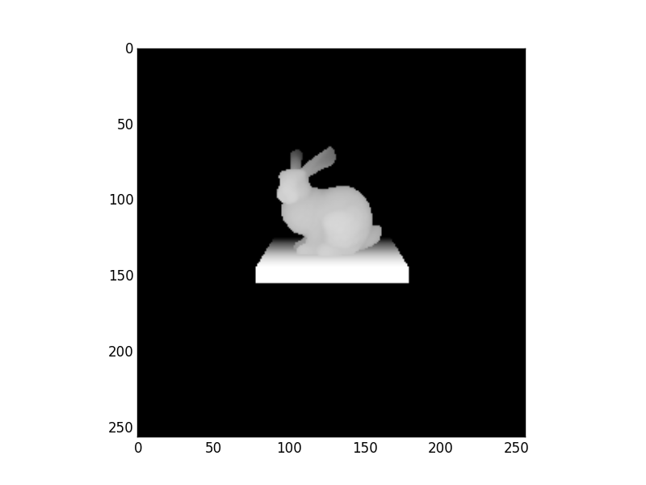

.. _demo_ray_intersection_points:

Ray Intersection Points
=======================

Rays are launched in the same way as the pinhole camera. The simple scene consists
of the Stanford bunny model sitting on a platform. For every ray that is launched,
the cartesian hit point of the ray with the materials in the scene (rabit and floor)
is recorded. In Figure 1 the 3D hit point for each ray in the camera is plotted in
3D space. In Figure 2 the z coordinate of each hit point is scaled and plotted to
indicate distance from the camera. Both methods allow simple visualisation of a
scene and extraction of intersection geometry data.

Bunny model source:
  Stanford University Computer Graphics Laboratory
  http://graphics.stanford.edu/data/3Dscanrep/
  Converted to obj format using MeshLab

.. literalinclude:: ../../../../demos/core/ray_intersection_hitpoints.py

.. figure:: ray_intersection_points_fig1.png

   The 3D intersection point of each camera ray with the materials in the scene is
   recorded and plotted as 3D points.

   The Z coordinate of each intersection point is scaled and plotted to
   indicate distance from the camera. This allows a crude form of scene
   visualisation.
