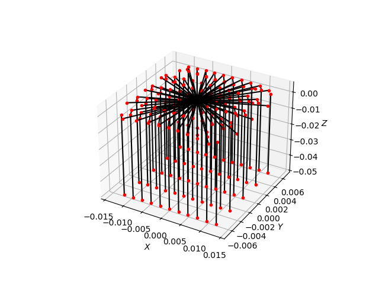

.. _demo_ray_logging_trajectories:

Ray Logging Trajectories
========================

This demonstration visualises full ray trajectories through a simple
optical system. The scene contains a symmetric bi-convex lens made of
Schott N-BK7 glass (used in transmission-only mode) and a large
absorbing target plane positioned behind the lens to terminate rays.

For each starting position on a small grid in front of the lens, a
:obj:`~.LoggingRay` is traced through the scene. At every interaction with a
surface, the ray records the intersection hit point. After tracing, the
logged points are plotted in 3D with :obj:`matplotlib` as both a polyline
(black) and discrete markers (red), revealing how rays refract and where
they intersect geometry.

See also :ref:`demo_ray_intersection_points` for a related example that
records only the first intersection point for each ray.

.. literalinclude:: ../../../../demos/optics/logging_trajectories.py

    Ray trajectories are logged and visualised in 3D space.
    Rays start on a grid in front of the lens, refract through the
    lens, and are absorbed by the target plane.
    Red dots indicate ray-surface intersection points and black lines
    show the full ray paths.