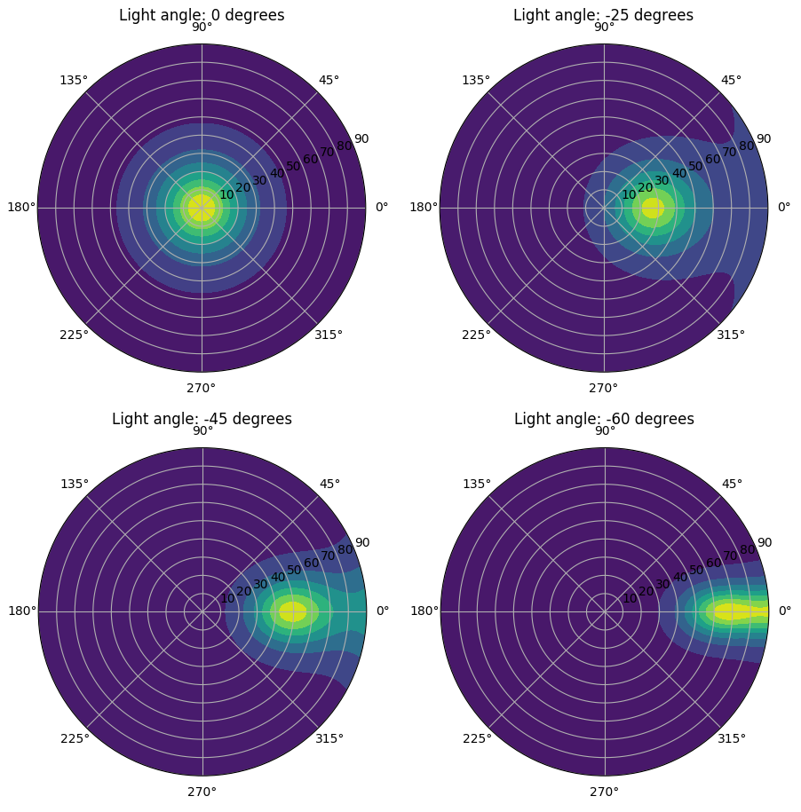
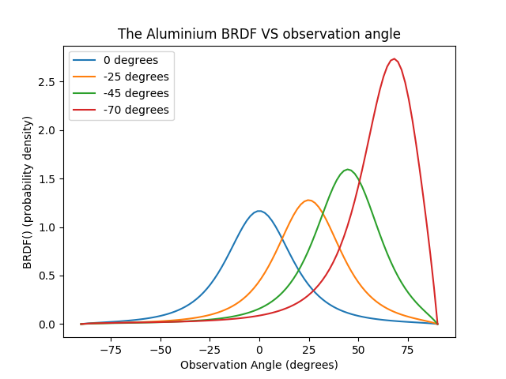

.. _demo_polar_brdf_plots:

Polar BRDF Plots
================

This example demonstrates how to sample the BRDFs of materials with the evaluate_brdf() method.

.. literalinclude:: ../../../../demos/reflectivity/plotting_brdfs.py

