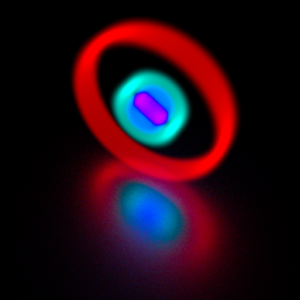

.. _demo_regular_grid_emitters:

Emitters defined on regular grids
=================================

This tutorial consists of four demos showing how to effectively use special volume
emitters that implement optimised ray-path integration over the regularly-spaced
grids.

Basic functionality
-------------------

This demo shows basic functions of the `RegularGridEmitter` class, an emitter material
designed to speed up ray-path integration of the emission profiles defined on
a regular 3D spatial grids.

.. literalinclude:: ../../../../demos/materials/regular_grid_emitters/0_regular_grid_emitter.py

Cartesian regular grids
-----------------------

This demo shows how the RegularGridBox helps to effectively integrate
the emissivity defined on a regular grid in Cartesian coordinates.

.. literalinclude:: ../../../../demos/materials/regular_grid_emitters/1_cartesian_regular_grid.py

Cylindrical regular grids
-------------------------

This demo shows how the RegularGridCylinder helps to effectively integrate
the emissivity defined on a regular grid in Cartesian coordinates.

.. literalinclude:: ../../../../demos/materials/regular_grid_emitters/2_cylindrical_regular_grid.py

Discrete spectrum
-----------------

This demo shows how to define a regular grid emitter with discrete spectrum.

.. literalinclude:: ../../../../demos/materials/regular_grid_emitters/3_discrete_spectrum.py

