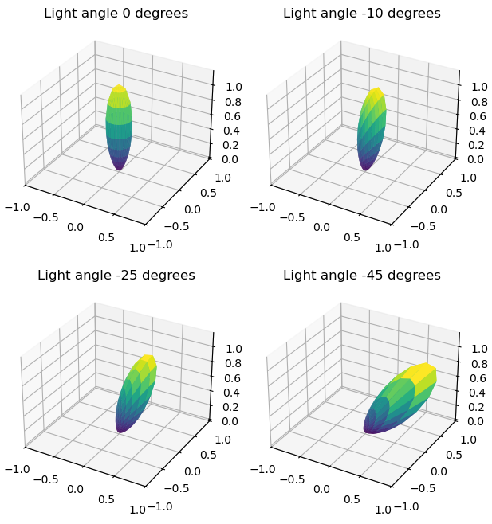

.. _demo_surface3d_brdf_plots:

3D surface BRDF plots
=====================

This example demonstrates how to make 3D surface plots of sampled material BRDF functions.

.. literalinclude:: ../../../../demos/reflectivity/plotting_brdfs_3d.py

