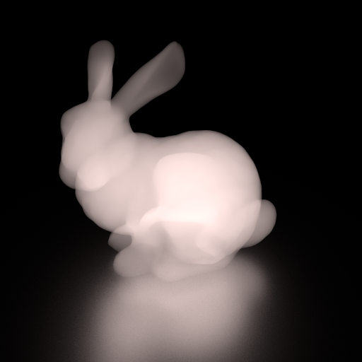

.. _demo_tetrahedra_mesh_emitters:

A Tetrahedral Mesh Emitter
==========================

In this example we make a tetrahedral mesh emitter by using a :class:`~raysect.core.math.function.float.function3d.interpolate.Discrete3DMesh` class.
Note that `Py3DViewer <https://github.com/cg3hci/py3DViewer>`_ is used to load a tetrahedra mesh, and each tetrahedra mesh has the unity volume emission.

.. literalinclude:: ../../../../demos/materials/tetrahedra_mesh_emission.py

