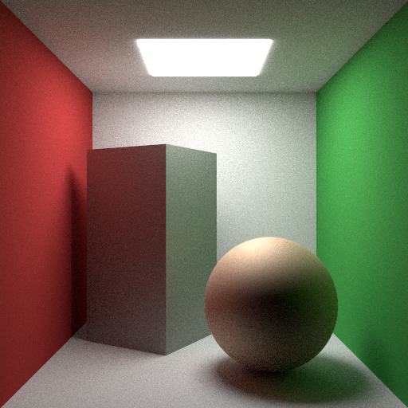

.. _demo_cornell_box:

Cornell Box
===========

This demo renders a variant of the classic Cornell Box scene.

To the original Cornell Box see:

    http://www.graphics.cornell.edu/online/box/data.html

The wall colours and light spectrum used in this demo are the values measured
for the physical Cornell Box.

.. literalinclude:: ../../../../demos/cornell_box.py

