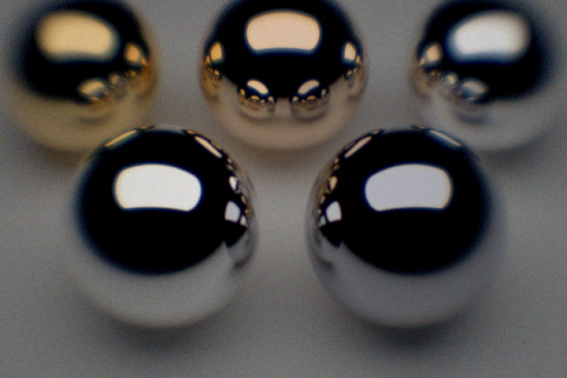

.. _demo_metal_ball_with_lens:

Making a camera 2
=================

A second example of making a custom camera from a CCD, aperture and lens.

.. literalinclude:: ../../../../demos/observers/metal_with_lens.py

