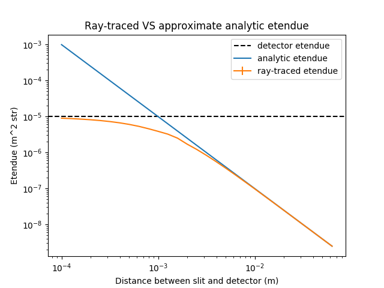

.. _demo_etendue_of_pinhole:

Etendue
=======

This example code calculates the etendue of a pinhole and compares it with
a simpler analytical calculation. The distance between the pinhole and
the observer is varied, showing that the ray-tracer exhibits the correct
limits. The method of calculation is described in Carr, M., Meakins, A., et al.
"Description of complex viewing geometries of fusion tomography diagnostics
by ray-tracing." Review of Scientific Instruments 89.8 (2018): 083506.

.. literalinclude:: ../../../../demos/optics/etendue_of_pinhole.py

