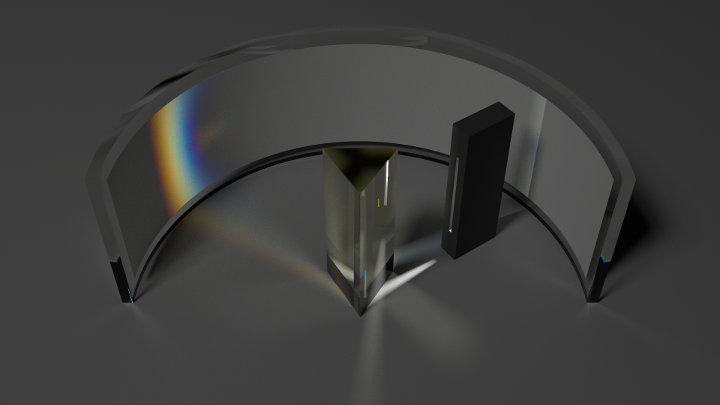

.. _demo_prism_dispersion:

Dispersion through a Prism
==========================

This demo demonstrates the dispersion of a white light source through a prism. Note, it may take a very long time to
generate adequate samples for this demonstration.

.. literalinclude:: ../../../../demos/prism.py

