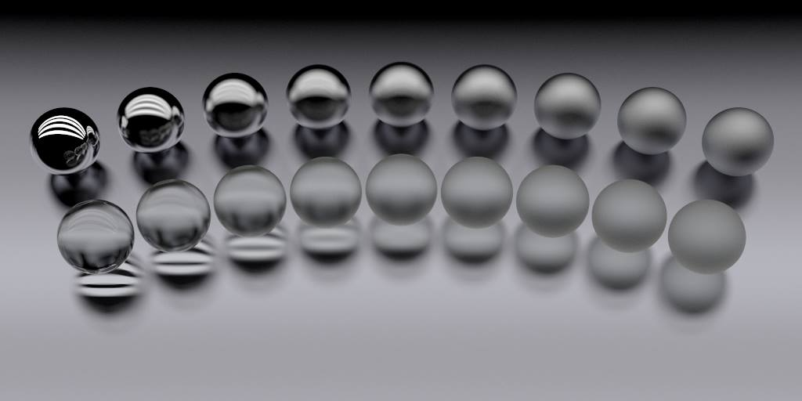

.. _demo_ray_intersection_points:

Surface Roughness Scan
======================

Demonstration of the roughen material modifier. The back row is aluminium and
the front row is glass. The surface roughness is increased from left to right
from 0 to 50%.

.. literalinclude:: ../../../demos/materials/material_roughness_scan.py

