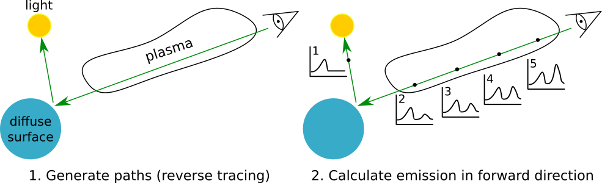

************
How it works
************

=====================
What is a ray tracer?
=====================

An algorithm for simulating light propogation, light is modelled as a bundle of rays
that travel through a scene. The paths of the rays follow a straight line unless
they interact with objects in the scene. As rays interact with materials, their
contribution to the emission is added/subtracted from the ray. A wide variety of
optical interactions can be simulated such as reflection and refraction, scattering,
and dispersion.

Same example scientific applications:

* Design of lenses and optical systems, such as cameras, microscopes and telescopes.
  Image-forming properties of a system to be modeled.
* Simulating optical diagnostics of plasmas through forward modelling, diagnostic
  design optimisation.

Ray-tracing is typically very computationally expensive and is best suited for
applications that don't require real-time calculation.

============
Key Concepts
============

Rays
~~~~

Represent a ray of light

* defines a line with an origin and direction
* wavelength range and number of spectral samples, centre of range used for refraction calculations

Ray objects must implement a tracing algorithm

* spectrum = ray.trace(world)
* causes the ray to start sampling the world
* returns a Spectrum object
* samples of spectral radiance: W/m 2 /str/nm

Observers
~~~~~~~~~

Represents objects that measure light, e.g. CCDs, cameras, photo diodes, eyes. Observers launch rays and accumulate
samples of the scene, which is more convenient than tracing individual rays manually.

* can be placed in the world and moved around
* observe() method triggers ray-tracing, i.e camera.observe()

Primitives
~~~~~~~~~~

Scenes in Raysect consist of primitives, which are the basic objects making up the scene. These are objects that rays
can interact with, e.g light sources, lenses, mirrors, diffuse surfaces. Types of primitives:

* Mathematically defined surfaces and solids (i.e. sphere, box, cylinder, cone).
* Constructive Solid Geometry Operators (union, intersect, subtract).
* Tri-poly meshes optimised for millions of polygons, support instancing. Importers for STL and OBJ.

Primitive surfaces and volumes can be assigned materials, e.g. glass, metal, emitter properties.

Scene-graph
~~~~~~~~~~~

Primitives and Observers are typically defined in their own local coordinate system but need to be placed into the
“world”. There needs to be a system to keep track of the locations/co-ordinate transforms of all objects in the scene.

The Scene-graph is a tree structure consisting of nodes, which can be both primitives and observers. Each node has an
associated coordinate space and is translated/rotated relative to it's parent node. I.e. a car node may have four
wheel nodes as children. Operations applied to a parent are automatically propogated down to all children. The resulting
data structure describes the spatial arrangement of primitives throughout a scene.

The World is the root node of the scene-graph - all primitives and observers must be attached to World. When adding
nodes to the world, nodes are always parented to another node (e.g. World) and given a transform (e.g. a translation
and/or rotation) relative to their parent. Allows us to build hierarchies of objects and manipulate the whole group with
one transform.

=====================
Process of raytracing
=====================

We desire the intensity/spectrum of light reaching an observer e.g. camera pixel.
Our strategy is to sample light (radiance) along paths reaching observer and
accumulate many samples to obtain intensity. Raysect uses a “Path tracing” algorithm
where we trace a ray from the observer through all material interactions until it
reaches a light source. Finally, we propagate the resulting spectrum from the light
source back through all material/volume interactions.

Ray-tracing is a recursive process in nature. For example, a ray hitting a diffuse surface will
need to know about light reflected from other sources in the scene. To get this emission we
re-evaluate the ray-tracing algorithm by generating a bundle of rays at this surface.
This process can repeat many times leading to a very high level of recursion.

Ray-tracing is bi-directional, the algorithm can be run in both the forward and reverse
directions. In forward ray-tracing, light is traced from the light sources through material
interactions to the observer. In backward ray-tracing, light starts at the observer and ray
paths are followed through to the sources of emission. Raysect traces light in the reverse
direction because this is generally more computationally efficient. The majority of light
rays fired from a light source won't reach the observer resulting in wasted computation.

.. figure:: images/ray-tracing_directions.png

   **Caption:** Ray-tracing algorithms are generally bi-directional and can be evaluated in both the
   forward and reverse directions. ray-tracing is naturally recursive. (Image credit: Carr, M.,
   Meakins, A., et. al. (2017))

During ray propogation, rays are tested for intersection with objects in the scene. Once
the nearest object has been identified, the material properties of the object are inspected
to determine the next step of the algorithm. Materials can alter the path of ray propagation
and alter the ray's spectra through absorption and reflection curves. Some materials will
require more rays to be launched to return an accurate spectra.

   **Caption:** In the first stage of path tracing, a single ray path is generated. This path may be
   represented by a number of smaller straight path segments that represent a ray's interactions
   with surfaces and light sources in the scene. Once the termination criteria has been met
   (absorbing surface or recursion limit, etc) the emission is evaluated along the segment stack
   in the forward direction. This ensures materials along the path can correctly add their emission
   or absorption. To estimate a light arriving at the observer, many of these paths will be measured
   and combined in a weighted average. (Image credit: Carr, M., Meakins, A., et. al. (2017))
