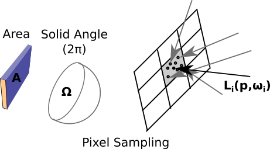
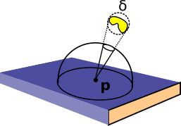
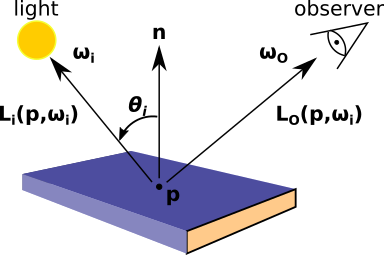

**********************
Sampling and Observers
**********************

=================================
Primer on Monte-Carlo Integration
=================================

Average value method
--------------------

The integrals encountered in optical ray-tracing are exact but difficult to evaluate
analytically for most physically relevant scenes. Monte-Carlo integration is a
technique for approximating the value of an integral by simulating a random process
with random numbers.

The simplest form of Monte-Carlo integration is the average value method, which starts by
considering the integral

.. math::

   I = \int_{a}^{b} f(x) dx

The average value of the function :math:`f(x)` over the domain can be expressed in terms
of the integral over the same domain.

.. math::

   <f> = \frac{1}{b-a} \int_{a}^{b} f(x) dx = \frac{I}{b-a}

Therefore, through manipulation we can express our integral in terms of the average of
:math:`f(x)`. We can measure :math:`<f(x)>` by sampling :math:`f(x)` at :math:`N` points
:math:`x_1`, :math:`x_2`, ..., :math:`x_N` chosen randomly between :math:`a` and
:math:`b`.

.. math::

   I \approx \frac{b-a}{N} \sum_{i=1}^{N} f(x_i) = \frac{1}{N} \sum_{i=1}^{N} \frac{f(x_i)}{p(x_i)}

:math:`p(x_i) = 1/(a-b)` is the uniform distribution we are sampling from. For a rectangular
pixel in a camera the sampling distributions would be uniformly distributed 2D points in the
square area :math:`A` and 3D vectors in the hemisphere :math:`\Omega`.

In general, the standard error on the approximation scales as :math:`1/\sqrt{N}` with
:math:`N` samples.

Importance Sampling
-------------------

The average value formula works well for smoothly varying functions but becomes inefficient when
the integral contains steep gradients or a divergence, for example, a bright point light source.
The standard error on the integral estimator can become large in such circumstances.

We can get around these problems by drawing the sample points :math:`x_i` from a non-uniform
probability density function (i.e. higher density for regions with stronger emission). Formally, :math:`p(x_i)`
is defined as

.. math::

   p(x_i) = \frac{w(x_i)}{\int_{a}^{b} w(x) dx}

where :math:`w(x)` is the weight function describing the distribution of sampling points. :math:`p(x)` has
the same functional shape as :math:`w(x)` but has been normalised so that its integral is 1. For uniform
sampling, :math:`w(x) = 1` and :math:`p(x_i) = 1/(b-a)` recovering the average value formula.

For the general case function :math:`w(x)` the estimator for the integral is now

.. math::

   I \approx \frac{1}{N} \sum_{i=1}^{N} \frac{f(x_i)}{w(x_i)} \int_{a}^{b} w(x) dx

This is the fundamental formula of importance sampling and a generalisation of the average
value method. It allows estimation of the integral :math:`I` by performing
a weighted sum, which can be weighted to have higher density in regions of interest. The price we
pay is that the random samples are being drawn from a more complicated distribution.

Importance sampling exploits the fact that the Monte-Carlo estimator converges fastest when samples
are taken from a distribution p(x) that is similar to the function f(x) in the integrand
(i.e. concentrate the calculations where the integrand is high).

Multiple Importance Sampling
----------------------------

It is difficult to construct a single sampling distribution that represents a physically relevant scene.
Instead, the integrand of the lighting equations can be approximated as sums and products of the
underlying features in a scene, such as individual light sources and geometry factors. Ideally we would
sample all candidate distributions in a physical scene.

Suppose the complicated integrand in our scene can approximated by a set operations on a number of simpler
underlying distributions. e.g.

.. math::

   f(x) = (f_1(x) + f_2(x)) \times f_3(x)

Multiple importance sampling is a generalisation of the importance sampling equation which allows us to
evaluate complicated integrands by simultaneously sampling multiple underlying important distributions
(see Veach, E. 1998). Without going into the derivation, the integrand becomes

.. math::

   I \approx \sum_{i=1}^{N} \sum_{j=1}^{n_i} \frac{w_i(x_{i,j}) f(x_{i,j})}{p(x_{i,j})}

with sample weights given by

.. math::

   w_i(x) = \frac{n_i p_i(x)}{\sum_j n_j p_j(x)}

==================
Observing Surfaces
==================

The total power (radiant flux) measured by an observing surface is given be the integral
of the incident radiance over the collecting solid angle :math:`\Omega` and surface
area :math:`A`. Therefore the observer equation is

.. math::

   \Phi = \int_{A} \int_{\Omega} L_{i}(x_j, \omega_j) \times \cos (\theta_j) d\omega dA

Here, :math:`L_{i}(x_j, \omega_j)` is the incident radiance at a given point :math:`x_j`
and incident angle :math:`\omega_j` on the observing surface. :math:`\cos (\theta_j)`
is a geometry factor describing the increase in effective observing area as the incident
rays become increasingly parallel to the surface.

The mean radiance measured by an observing surface is simply

.. math::

   L = \frac{\Phi}{A \Omega}.

All raysect observers measure the mean spectral radiance :math:`L` as their base quantity.
All other quantities of interest can be evaluated through integration over areas, solid
angles and nm.

Let us now re-express this equation in terms of a general Monte Carlo estimator. The
samples will be drawn from two different distributions, 2D points on the observing
surface and 3D Vectors over the :math:`2/pi` solid angle hemisphere. Therefore, the
average value estimator would become

.. math::
   L = \frac{1}{N} \sum_{j=1}^{N} \frac{L_i(x_j, \omega_j) \cos(\theta_j)}{p_A(x_j) p_\Omega(\omega_j) A \Omega}

where :math:`p_A(x_j)` is the probability of drawing sample point :math:`x_j` from
area :math:`A` and :math:`p_\Omega(\omega_j)` is the probability of drawing sample
vector :math:`\omega_j` from solid angle :math:`\Omega`.

This is the root equation being evaluated in all Raysect observers. In most cases
the detector area is sampled with uniform sampling and hence :math:`p_A(x_j) = 1/A`
ends up cancelling :math:`A` out of the equation. It is far more common to use a variety
of sampling strategies for the sample directions, :math:`\omega_j`, and hence
:math:`p_\Omega(\omega_j)` is typically more important.

Let us now consider some more specialised cases.

   **Caption:** Example sampling geometry for a pixel in a camera. (Image credit: Carr, M.,
   Meakins, A., et. al. (2017))

CCD Pixel with Uniform Hemisphere Sampling
------------------------------------------

Let us consider one of the most common cases for an observing surface, a rectangular
pixel surface with a hemisphere of solid angle over which incident light can be collected.
To calculate the Monte Carlo estimator we need :math:`N` sample points and vectors. The simplest
vector distribution would be the uniform distribution where all angles over :math:`2 \pi` have equal
probability of being sampled. The weighting distribution is

.. math::
   w(\omega) = 1.

Thus the distributions normalisation constant evaluates to the area of solid angle being sampled, similar to
the :math:`b-a` length scale for the 1D cartesian case.

.. math::
   c = \int_{0}^{2\pi} \int_{0}^{\frac{\pi}{2}} \sin(\theta) d\theta d\phi = 2 \pi

Therefore :math:`p(\omega)` for uniformly distributed vectors is

.. math::
   p_\Omega(\omega_j) = \frac{w(\omega_j)}{\int_{a}^{b} w(\omega) d\omega} = \frac{1}{2 \pi}.

The estimator for the mean radiance becomes

.. math::
   L = \frac{1}{N} \sum_{j=1}^{N} L_i(x_j, \omega_j) \cos(\theta_j)

CCD Pixel with a Cosine distribution
------------------------------------

As mentioned above, it is often advantageous to draw samples from a distribution with similar shape
to the function being integrated. The observer equation is weighted with a cosine theta term meaning
that vector samples near the top of the hemisphere are weighted much more than samples near the edge.
Hence it is useful to generate vector samples proportional to the cosine distribution.

.. math::

   w(\omega_j) = \cos(\theta_j)

The normalisation constant, :math:`c`, can be evaluated by integrating :math:`w(\omega)` over the domain.

.. math::
   c = \int_{0}^{2\pi} \int_{0}^{\frac{\pi}{2}} w(\omega) \sin(\theta) d\theta d\phi = \pi

Therefore :math:`p(\omega_j)` for a cosine distribution would be

.. math::
   p_\Omega(\omega_j) = \frac{w(\omega_j)}{\int_{a}^{b} w(\omega) d\omega} = \frac{\cos(\theta)}{\pi}

and the estimator becomes

.. math::
   L = \frac{1}{N} \sum_{j=1}^{N} L_i(x_j, \omega_j) \cos(\theta_j) \frac{\pi}{\cos(\theta_j) \Omega} = \frac{1}{2N} \sum_{j=1}^{N} L_i(x_j, \omega_j)

Note that the cosine factors have cancelled, which makes sense since we are treating
the :math:`\cos(\theta)` term as the important distribution.

Optical Fibre
-------------

Consider an optical fibre with circular area :math:`A_f` and radius :math:`r_f`. The area of solid angle
over which light can be collected is a cone with half angle :math:`\theta_{max}`. The circular area can
be sampled with uniformly distributed points, meaning :math:`p_A(x_j)` would cancel out again. An
appropriate vector sampling distribution is the uniform cone, where vectors are sampled uniformly
over the circular solid angle centred around the z-axis with angle to z :math:`\theta_{max}`. Samples
around the z-axis can be transformed by rotation without effecting the sample density. The weighting
function is uniform and hence

.. math::
   w(\omega) = 1.

The normalisation constant for the distribution is now the fractional solid angle area,

.. math::
   c = \int_{0}^{2\pi} \int_{0}^{\theta_{max}} \sin(\theta) d\theta d\phi = 2\pi (1-\cos(\theta_{max})) = \Omega_{\theta_{max}},

with corresponding pdf equal to

.. math::
   p_\Omega(\omega_i) = \frac{1}{\Omega_{\theta_m}}.

The estimator is

.. math::
   L = \frac{(1-\cos(\theta_{max}))}{N} \sum_{i=1}^{N} L_i(x_i, \omega_i) \cos(\theta_i).

Sampling the lights
-------------------

Arbitrary light sources and important primitives can be sampled with the projection method. The
light (or primitive) in question is wrapped in a bounding sphere that just encloses the object.
It is then a matter of projecting the bounding sphere into a uniform cone at the surface of the
sample point. The vector from the sample point to the bounding sphere can be used to find a disk
inside the bounding sphere that defines the effective solid angle to be sampled.

   **Caption:** A complex light source sampled with the projection method.

=================
Material Surfaces
=================

The amount of light that reaches a camera from a point on an object surface is
given by the sum of light emitted and reflected from other sources.

.. math::

   L_{O}(p, \omega_O) = \int_{\Omega} L_{i}(p, \omega_i) \times f(\omega_i, \omega_o) \times \cos (\theta_i) d\omega_i

This equation is the same as the observer equation with the addition of the
bidirectional reflectance distribution function (BRDF) term :math:`f(\omega_i , \omega_o )`.
The BRDF is a weighting function that describes the redistribution of incident light
into outgoing reflections and transmission/absorption. It is commonly approximated in
terms of two ideal material components, specular and diffuse reflections. Ideal specular
reflection behaves like a mirror where the incoming light is perfectly reflected into
one angle, :math:`f_s (\omega_i, \omega_o ) = \rho_s(\omega_i )\delta(\omega_i ,\omega_o )`.
An ideal diffuse surface (matte paper) will evenly redistribute incident light across all
directions and hence has no angular dependance, :math:`f_d (\omega_i , \omega_o ) = \rho_d /\pi`.
Real physical materials exhibit a complex combination of both behaviours in addition to
transmission and absorption.

   **Caption:** Example geometry for light reflected from a material surface. (Image credit: Carr, M.,
   Meakins, A., et. al. (2017))

Sampling the BRDF
-----------------

===================
Participating Media
===================

Volume scattering, fluorescence and opacity effects.
