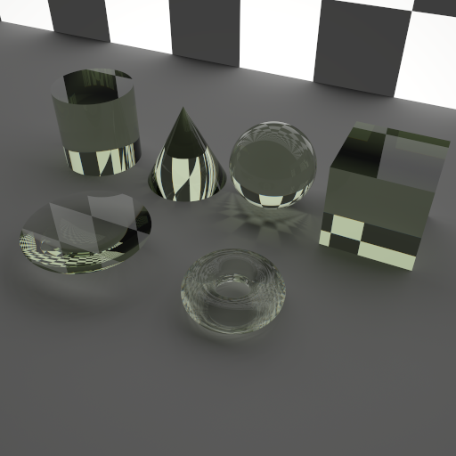
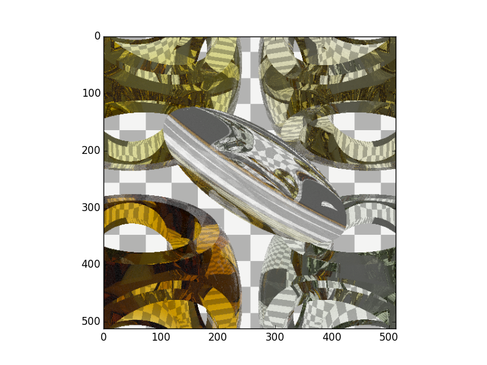
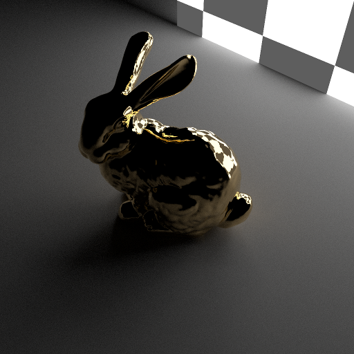

**********
Primitives
**********

The raysect primitives: sphere; box; cylinder; and cone.

====================
Geometric Primitives
====================

Sphere
~~~~~~
.. autoclass:: raysect.primitive.Sphere

Box
~~~
.. autoclass:: raysect.primitive.Box

Cylinder
~~~~~~~~

.. autoclass:: raysect.primitive.Cylinder

Cone
~~~~

.. autoclass:: raysect.primitive.Cone

==============
CSG Operations
==============

Operations such as union, substract, intersect on some basic glass primitives::

   # Making the lense in the centre
   s1 = Sphere(1.0, transform=translate(0, 0, 1.0-0.01))
   s2 = Sphere(0.5, transform=translate(0, 0, -0.5+0.01))
   Intersect(s1, s2, world, translate(0,0,-3.6)*rotate(50,50,0), glass)

   # More complex glass structure
   cyl_x = Cylinder(1, 4.2, transform=rotate(90, 0, 0)*translate(0, 0, -2.1))
   cyl_y = Cylinder(1, 4.2, transform=rotate(0, 90, 0)*translate(0, 0, -2.1))
   cyl_z = Cylinder(1, 4.2, transform=rotate(0, 0, 0)*translate(0, 0, -2.1))
   cube = Box(Point3D(-1.5, -1.5, -1.5), Point3D(1.5, 1.5, 1.5))
   sphere = Sphere(2.0)

   Intersect(sphere, Subtract(cube, Union(Union(cyl_x, cyl_y), cyl_z)), world, translate(-2.1,2.1,2.5)*rotate(30, -20, 0), glass)

======
Meshes
======

It is easiest to import meshes from existing CAD files in either obj or stl with the helper methods.

.. autofunction:: raysect.primitive.mesh.obj.import_obj

.. autofunction:: raysect.primitive.mesh.stl.import_stl

An example::

   from raysect.primitive.mesh import import_obj
   mesh = import_obj("./resources/stanford_bunny.obj", scaling=1, parent=world,
                     transform=translate(0, 0, 0)*rotate(165, 0, 0), material=gold)

