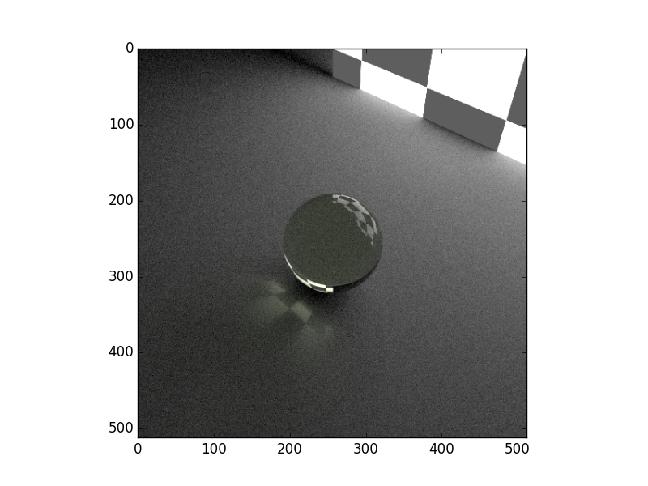
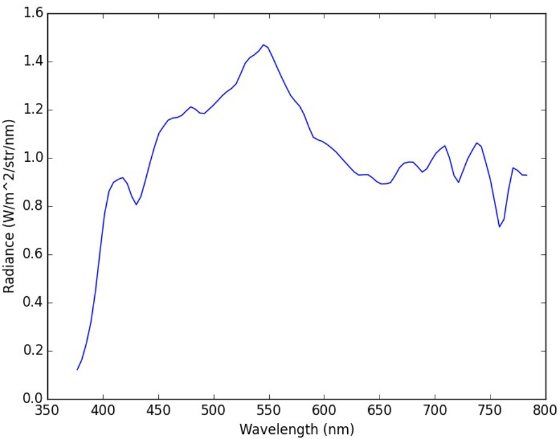

****************
Quickstart Guide
****************

This example is based on the demo file demos/quickstart/demo_lambert.py. It outlines the typical workflow used in
raysect.

=================
Create Primitives
=================

Set-up your primitives by defining materials, meshes, etc::

    # Box defining the ground plane
    ground = Box(lower=Point3D(-50, -1.51, -50), upper=Point3D(50, -1.5, 50), material=Lambert())

    # checker board wall that acts as emitter
    emitter = Box(lower=Point3D(-10, -10, 10), upper=Point3D(10, 10, 10.1),
                  material=Checkerboard(4, d65_white, d65_white, 0.1, 2.0), transform=rotate(45, 0, 0))

    # Sphere
    # Note that the sphere must be displaced slightly above the ground plane to prevent numerically issues that could
    # cause a light leak at the intersection between the sphere and the ground.
    sphere = Sphere(radius=1.5, transform=translate(0, 0.0001, 0), material=schott("N-BK7"))

============
Add Observer
============

Add an observer and configure its sampling settings. All of these camera settings have sensible defaults, The camera
settings will be explained in detail in another section::

    # processing pipeline (human vision like camera response)
    rgb = RGBPipeline2D()

    # camera
    camera = PinholeCamera(pixels=(512, 512), fov=45, pipeline=[rgb], transform=translate(0, 10, -10) * rotate(0, -45, 0))

    # camera - pixel sampling settings
    camera.pixel_samples = 250
    camera.min_wavelength = 375.0
    camera.max_wavelength = 740.0
    camera.spectral_bins = 15
    camera.spectral_rays = 1

================
Build Scenegraph
================

Assemble the scene-graph by linking primitives and observers to the World. Set their transforms::

    world = World()

    sphere.parent = world
    ground.parent = world
    emitter.parent = world
    camera.parent = world

=========
Observe()
=========

Call observe() on an Observer or trace a ray manually::

    plt.ion()
    camera.observe()

    plt.ioff()
    rgb.save("render.png")
    rgb.display()

The resulting image should render like this.

==================
Simulated Spectrum
==================

Lets simulate measuring a spectrum by launching a single ray::

    ray = Ray(origin=Point3D(0, 0, -5),
              direction=Vector3D(0, 0, 1),
              min_wavelength=375,
              max_wavelength=785,
              bins=100)

    ray.trace(world)

The resulting plot should look something like this.

Due to the statistical nature of the path tracer, you may need to run the trace command more than once until you find a path that intersects with the light source.

You can ask the ray to trace repeatedly using the sample method instead. This will combine the results of multiple paths::

    ray.sample(world, 10000)
